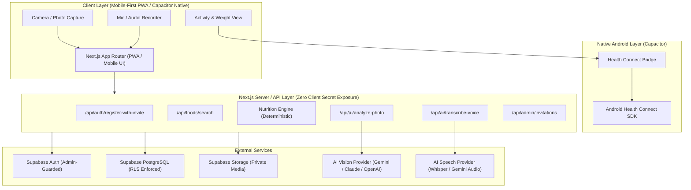
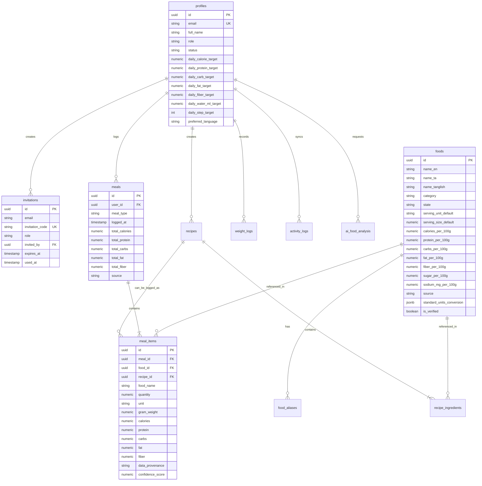
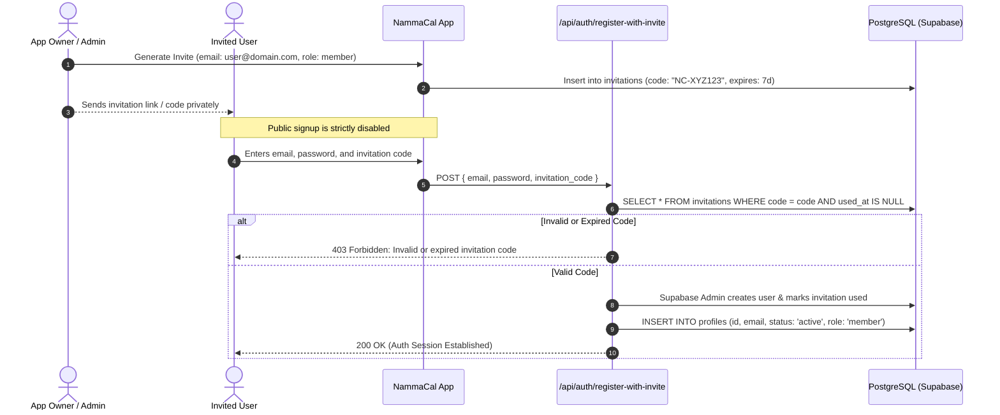
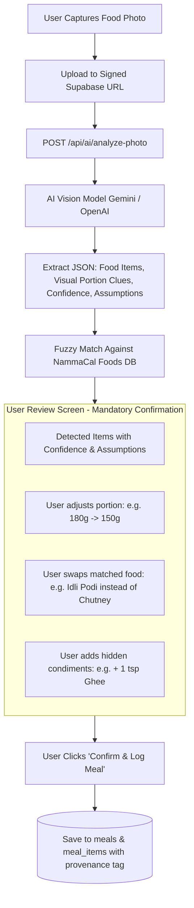
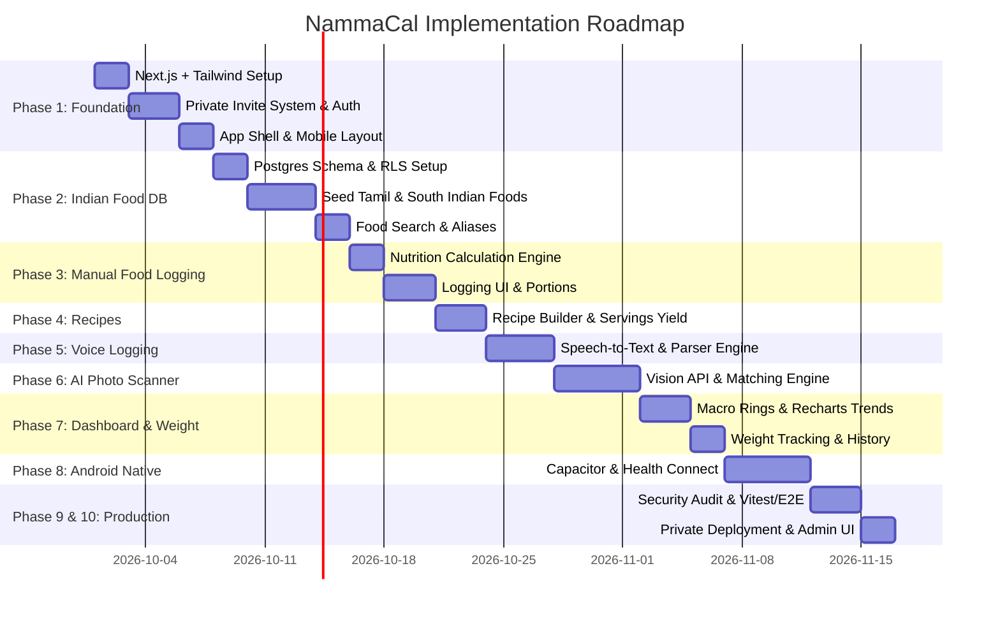

# NammaCal — Implementation Plan & System Architecture

**Document Version:** 1.0.0  
**Project:** NammaCal (Private Nutrition, Macro, Weight & Activity Tracker)  
**Target Focus:** Indian Foods (Tamil Nadu & South Indian Cuisine Specialist)  
**Platform Target:** Mobile-First Web Application / PWA → Android (via Capacitor & Health Connect)  
**Access Model:** Strict Private & Invite-Only (Zero Public Registration)

---

## 1. Workspace Inspection & Current State

### 1.1 Findings
- **Workspace Directory:** `c:\CAFE CAL`
- **Initial State:** Completely empty directory.
- **Git Repository:** Not initialized (`.git` does not exist).
- **Environment & Runtimes Detected:**
  - **Node.js:** `v24.19.0`
  - **npm:** `11.17.0` (accessible via `npm.cmd` on Windows PowerShell)
  - **OS:** Windows 10/11
- **Existing Files & Technologies:** None. The project is starting from a clean slate. No legacy files or dependencies will be overwritten.

---

## 2. System Architecture & Tech Stack



### 2.1 Technology Stack Selection & Rationale
| Layer | Technology | Rationale |
| :--- | :--- | :--- |
| **Frontend Framework** | **Next.js 15 (App Router, TypeScript)** | Server components for initial render, responsive mobile-first layouts, integrated API route layer. |
| **Styling** | **Tailwind CSS + Lucide Icons** | Ultra-lean, mobile-optimized utility classes, zero runtime overhead, touch-first ergonomic controls. |
| **Database & Auth** | **Supabase (PostgreSQL 15+ & Supabase Auth)** | Native Row Level Security (RLS) guarantees user isolation at the database layer; robust Auth triggers. |
| **File Storage** | **Supabase Storage** | Encrypted S3-compatible object storage with signed URLs for food analysis images. |
| **Validation** | **Zod** | End-to-end type safety for API route payloads, database transforms, and unit conversion inputs. |
| **AI Vision & Audio** | **Provider-Agnostic Abstraction Layer** | Implements `IVisionFoodAnalyzer` and `ISpeechToTextProvider`. Default: Google Gemini 1.5 Flash / Pro (fast, multimodal, cost-effective). |
| **Charts** | **Recharts** | Lightweight, responsive SVG rendering for daily calorie bars, macro breakdowns, and weight trends. |
| **Native Mobile** | **Capacitor (`@capacitor/core`, `@capacitor/android`)** | Direct path from web PWA to Android APK without code duplication; native bridge for Health Connect. |
| **Testing** | **Vitest + Playwright** | Fast unit tests for nutrition maths; end-to-end tests for invite gating and food logging. |

---

## 3. Database Schema (PostgreSQL with Row Level Security)

All user-owned tables enforce PostgreSQL **Row-Level Security (RLS)** ensuring that:
$$\text{SELECT / INSERT / UPDATE / DELETE} \implies \text{auth.uid()} = \text{user\_id}$$



### 3.1 Table Definitions & Types

#### 1. `profiles`
Extends `auth.users`.
- `id`: UUID (Primary Key, references `auth.users.id` ON DELETE CASCADE)
- `email`: TEXT UNIQUE NOT NULL
- `full_name`: TEXT
- `role`: TEXT NOT NULL DEFAULT `'member'` CHECK (`role` IN ('owner', 'admin', 'member'))
- `status`: TEXT NOT NULL DEFAULT `'active'` CHECK (`status` IN ('pending', 'active', 'disabled'))
- `invited_by`: UUID (references `profiles.id`)
- `daily_calorie_target`: NUMERIC(6,1) DEFAULT 2000
- `daily_protein_target`: NUMERIC(5,1) DEFAULT 100
- `daily_carb_target`: NUMERIC(5,1) DEFAULT 250
- `daily_fat_target`: NUMERIC(5,1) DEFAULT 65
- `daily_fiber_target`: NUMERIC(5,1) DEFAULT 30
- `daily_water_ml_target`: NUMERIC(6,1) DEFAULT 3000
- `daily_step_target`: INTEGER DEFAULT 8000
- `preferred_language`: TEXT DEFAULT `'en'` CHECK (`preferred_language` IN ('en', 'ta', 'tanglish'))
- `created_at`: TIMESTAMPTZ DEFAULT NOW()
- `updated_at`: TIMESTAMPTZ DEFAULT NOW()

#### 2. `invitations`
Guards system entry.
- `id`: UUID PRIMARY KEY DEFAULT gen_random_uuid()
- `email`: TEXT NOT NULL
- `invitation_code`: TEXT UNIQUE NOT NULL
- `role`: TEXT NOT NULL DEFAULT `'member'` CHECK (`role` IN ('member', 'admin'))
- `invited_by`: UUID NOT NULL REFERENCES `profiles(id)`
- `expires_at`: TIMESTAMPTZ NOT NULL
- `used_at`: TIMESTAMPTZ NULL
- `created_at`: TIMESTAMPTZ DEFAULT NOW()

#### 3. `foods`
Core Indian nutrition database.
- `id`: UUID PRIMARY KEY DEFAULT gen_random_uuid()
- `name_en`: TEXT NOT NULL (e.g., "Ponni Boiled Rice")
- `name_ta`: TEXT (e.g., "பொன்னி புழுங்கல் அரிசி")
- `name_tanglish`: TEXT (e.g., "Ponni Puzhungal Arisi")
- `category`: TEXT NOT NULL CHECK (`category` IN (
  'rice', 'millets', 'wheat', 'dals_pulses', 'vegetables', 'fruits', 
  'dairy', 'poultry', 'meat_seafood', 'snacks_tamil', 'snacks_indian', 
  'breakfast_south', 'lunch_south', 'dinner_south', 'sweets', 'beverages', 
  'oils_fats', 'spices', 'packaged', 'restaurant', 'other'
))
- `state`: TEXT NOT NULL CHECK (`state` IN ('raw', 'cooked', 'packaged'))
  > **CRITICAL SEPARATION:** 100g raw Ponni rice (350 kcal, 7g protein) has a distinct record from 100g cooked Ponni rice (130 kcal, 2.5g protein).
- `serving_unit_default`: TEXT NOT NULL DEFAULT 'g'
- `serving_size_default`: NUMERIC(6,2) DEFAULT 100
- `calories_per_100g`: NUMERIC(6,2) NOT NULL
- `protein_per_100g`: NUMERIC(6,2) NOT NULL
- `carbs_per_100g`: NUMERIC(6,2) NOT NULL
- `fat_per_100g`: NUMERIC(6,2) NOT NULL
- `fiber_per_100g`: NUMERIC(6,2) DEFAULT 0
- `sugar_per_100g`: NUMERIC(6,2) NULL
- `sodium_mg_per_100g`: NUMERIC(6,2) NULL
- `source`: TEXT NOT NULL CHECK (`source` IN ('ifct_verified', 'verified_nammacal', 'usda_verified', 'user_custom'))
- `standard_units_conversion`: JSONB DEFAULT '{}'::jsonb
  *(Example: `{"piece": 45, "cup": 180, "tbsp": 15, "katori": 150}`)*
- `is_verified`: BOOLEAN DEFAULT FALSE
- `created_by`: UUID NULL REFERENCES `profiles(id)`
- `created_at`: TIMESTAMPTZ DEFAULT NOW()
- `updated_at`: TIMESTAMPTZ DEFAULT NOW()

#### 4. `food_aliases`
For phonetic searching, Tanglish, and local Tamil dialect matching.
- `id`: UUID PRIMARY KEY DEFAULT gen_random_uuid()
- `food_id`: UUID NOT NULL REFERENCES `foods(id)` ON DELETE CASCADE
- `alias`: TEXT NOT NULL (e.g., "satham", "saatham", "soru", "chawal", "arisi satham")
- `language`: TEXT DEFAULT 'tanglish' CHECK (`language` IN ('en', 'ta', 'tanglish', 'hindi'))

#### 5. `recipes` & `recipe_ingredients`
For home-cooked dishes with custom serving yield calculations.
- `recipes`: `id`, `user_id`, `name`, `description`, `servings` (NUMERIC), `total_weight_g`, `calories_per_serving`, `protein_per_serving`, `carbs_per_serving`, `fat_per_serving`, `fiber_per_serving`, `is_public` (owner can publish), timestamps.
- `recipe_ingredients`: `id`, `recipe_id`, `food_id`, `quantity`, `unit`, `gram_weight`, `calories`, `protein`, `carbs`, `fat`, `fiber`.

#### 6. `meals` & `meal_items`
- `meals`: `id`, `user_id`, `meal_type` ('breakfast', 'lunch', 'snack', 'dinner', 'other'), `logged_at` (TIMESTAMPTZ), `notes`, `total_calories`, `total_protein`, `total_carbs`, `total_fat`, `total_fiber`, `source` ('manual', 'voice', 'ai_photo', 'recipe').
- `meal_items`: `id`, `meal_id`, `food_id`, `recipe_id`, `food_name`, `quantity`, `unit`, `gram_weight`, `calories`, `protein`, `carbs`, `fat`, `fiber`, `sugar`, `sodium_mg`, `confidence_score`, `data_provenance` ('verified_db', 'user_edited', 'ai_estimate').

#### 7. `weight_logs`
- `id`: UUID PRIMARY KEY DEFAULT gen_random_uuid()
- `user_id`: UUID NOT NULL REFERENCES `profiles(id)` ON DELETE CASCADE
- `recorded_date`: DATE NOT NULL
- `weight_kg`: NUMERIC(5,2) NOT NULL
- `waist_cm`: NUMERIC(5,2) NULL
- `notes`: TEXT NULL
- `created_at`: TIMESTAMPTZ DEFAULT NOW()
- UNIQUE(`user_id`, `recorded_date`)

#### 8. `activity_logs`
- `id`: UUID PRIMARY KEY DEFAULT gen_random_uuid()
- `user_id`: UUID NOT NULL REFERENCES `profiles(id)` ON DELETE CASCADE
- `activity_date`: DATE NOT NULL
- `steps`: INTEGER DEFAULT 0
- `step_source`: TEXT DEFAULT 'manual' CHECK (`step_source` IN ('health_connect', 'manual', 'mock'))
- `active_calories`: NUMERIC(6,1) DEFAULT 0
- `calorie_source_type`: TEXT DEFAULT 'estimated_calculation' CHECK (`calorie_source_type` IN ('device_reported', 'estimated_calculation'))
- `distance_meters`: NUMERIC(8,1) NULL
- `water_ml`: NUMERIC(6,1) DEFAULT 0
- `synced_at`: TIMESTAMPTZ DEFAULT NOW()
- UNIQUE(`user_id`, `activity_date`)

#### 9. `ai_food_analysis` & `food_images`
- `ai_food_analysis`: Audit table tracking image URL, raw model response, detected items, confidence scores, assumptions, and boolean `user_accepted`.
- `food_images`: Tracks private storage paths in Supabase Storage with ownership binding.

---

## 4. Private Invite-Only & Access Architecture



### 4.1 Strict Guardrails Against Public Registration
1. **Disabled Public Sign-up in Supabase:** Supabase Auth is configured with `Enable email signup: FALSE`. Only the server-side Supabase Service Role client can create users after verifying an invite.
2. **Atomic Verification:** Invitation validation and profile creation run in a single atomic transaction. Once used, `used_at` is stamped, preventing replay attacks.
3. **Owner Admin Controls:**
   - Owner can revoke or expire pending invites.
   - Owner can change user `status` from `'active'` to `'disabled'` at any moment.
   - Middleware on every request checks if `profiles.status == 'active'`. Disabled users receive immediate 401/403 status and session invalidation.
4. **Row Level Security (RLS) Isolation:**
   - Members cannot query or view other members' profiles, weight, activity, or meal data.
   - Owner role has full administrative view privileges for member audits.

---

## 5. Nutrition Calculation Engine & Indian Food Model

### 5.1 Unit Conversion Pipeline
The calculation engine is a pure, deterministic TypeScript module covered by unit tests.

$$\text{ratio} = \frac{\text{effective\_gram\_weight}}{100}$$
$$\text{Calories} = \text{round}(\text{calories\_per\_100g} \times \text{ratio}, 1)$$
$$\text{Macro}_i = \text{round}(\text{macro\_per\_100g}_i \times \text{ratio}, 2)$$

```typescript
// Standard unit conversion logic
export function resolveGramWeight(food: Food, quantity: number, unit: string): number {
  switch (unit.toLowerCase()) {
    case 'g':
    case 'grams':
      return quantity;
    case 'kg':
    case 'kilograms':
      return quantity * 1000;
    case 'mg':
      return quantity * 0.001;
    case 'ml':
      // Density ~ 1g/ml unless food-specific density is defined
      return quantity;
    case 'l':
    case 'litres':
      return quantity * 1000;
    default:
      // Household and portion measurements defined in standard_units_conversion
      const conversionMap = food.standard_units_conversion || {};
      const unitFactor = conversionMap[unit.toLowerCase()];
      if (unitFactor) {
        return quantity * unitFactor;
      }
      throw new Error(`Unit '${unit}' is not configured for food '${food.name_en}'. Please specify grams.`);
  }
}
```

### 5.2 Raw vs. Cooked Distinctions in Indian Cooking
The database enforces explicit cooking states:
- **Raw Ponni Rice:** ~355 kcal, 7.0g protein, 79g carbs, 0.6g fat per 100g (water content ~12%).
- **Cooked Ponni Rice (Satham):** ~130 kcal, 2.5g protein, 28g carbs, 0.3g fat per 100g (water absorption ratio ~1:2.6).
- **Raw Toor Dal:** ~340 kcal, 22g protein, 62g carbs, 1.5g fat per 100g.
- **Cooked Plain Toor Dal:** ~115 kcal, 7.5g protein, 20g carbs, 0.5g fat per 100g.
- **Tamil Household Measures Matrix:**
  - 1 standard South Indian katori/bowl of Sambar = ~150g
  - 1 medium Idli = ~45g (approx. 58 kcal, 2g protein)
  - 1 plain Dosa = ~80g (approx. 165 kcal, 3.5g protein, 4g fat from oil)
  - 1 Medu Vada = ~45g (approx. 140 kcal, 3.2g protein, 9g fat)
  - 1 tbsp cooking oil (sesame/gingelly, groundnut, sunflower) = ~14g (125 kcal, 14g fat)

---

## 6. AI Photo Scanner Architecture

### 6.1 Strict Accuracy Philosophy & Disclaimers
> [!IMPORTANT]
> **No Magic Numbers:** Computer vision cannot weigh food, measure internal oil, detect added sugars, or determine exact moisture content.
> - The application **never** claims photo analysis is 100% accurate.
> - Every AI estimate is explicitly flagged as `ai_estimate` with visual assumptions stated in plain English.
> - The user **must** review, adjust quantities, confirm or swap matched items, and press "Confirm" before any meal is saved.



### 6.2 Provider-Agnostic Interface
```typescript
export interface DetectedFoodCandidate {
  raw_food_name: string;
  matched_food_id?: string;
  estimated_quantity: number;
  unit: string;
  confidence_score: number; // 0.0 - 1.0
  visual_assumptions: string; // e.g. "Estimated 3 medium idlis based on plate proportion"
}

export interface IVisionFoodAnalyzer {
  analyzeMealImage(imageBuffer: Buffer, mimeType: string): Promise<DetectedFoodCandidate[]>;
}
```

---

## 7. Voice Food Entry Architecture

### 7.1 Speech-to-Text & Indian English / Tanglish Parsing
1. **Audio Capture:** Captured via Web Audio / MediaRecorder API (compressed to Opus/WebM or AAC) and streamed to `/api/ai/transcribe-voice`.
2. **Audio Transcription:** Processed server-side using Whisper or Gemini Multimodal audio input.
3. **Food & Quantity Extraction Engine (`IFoodTextParser`):**
   - Supports English: *"200 grams paneer, 100 grams onion, 200 grams tomato and 6 grams sunflower oil"*.
   - Supports Tanglish & Tamil culinary expressions: *"rendu idli, oru cup sambar, ara spoon ghee"*, *"oru katori curd rice, 1 spoon oorugai"*.
4. **Disambiguation Guardrail:**
   - If the user says *"rice"*, the system does **not** guess whether it is raw or cooked.
   - It outputs: `food: "Rice", ambiguity: "Cooking state not specified. Defaulted to Cooked Rice. Please confirm or switch to Raw."`
5. **Confirmation UI:** The parsed ingredients appear as an editable checklist with macro calculations previewed before logging.

---

## 8. Activity & Health Connect Architecture

### 8.1 Provider Abstraction
```typescript
export interface DailyActivitySummary {
  date: string;
  steps: number;
  stepSource: 'health_connect' | 'manual' | 'mock';
  activeCalories: number;
  calorieSourceType: 'device_reported' | 'estimated_calculation';
  waterMl?: number;
}

export interface IActivityProvider {
  getDailyActivity(date: Date): Promise<DailyActivitySummary>;
  syncSteps(): Promise<boolean>;
}
```

### 8.2 Android Health Connect Guardrails
- **No GPS Step Spoofing:** Steps are strictly read from Android Health Connect `StepsRecord`. Vehicle travel distance (e.g. 15 km in an MTC bus) is never converted into walking steps.
- **Calorie Transparency:** If the connected wearable/Health Connect reports `ActiveCaloriesBurnedRecord`, it is labeled `"Device Reported"`. If calculated based on user weight and steps, it is labeled `"Estimated Activity Calories"`.
- **Deduplication:** Health Connect automatically handles aggregation across multiple device sources (e.g., smart watch + phone sensor).

---

## 9. Security Model & Data Protection

| Vector | Defense Mechanism |
| :--- | :--- |
| **API Secret Exposure** | AI API keys (`GEMINI_API_KEY`, `OPENAI_API_KEY`) and Supabase Service Role keys are **strictly server-side** (never prefixed with `NEXT_PUBLIC_`). |
| **User Data Isolation** | PostgreSQL **Row Level Security (RLS)** applied on all tables. Even if a compromised token tries to query another user's `user_id`, Postgres returns empty sets. |
| **Public Registration Exploits** | Public sign-up is turned off in Supabase Auth. Creation requires passing through the verified invite route `/api/auth/register-with-invite`. |
| **Media Injection / Upload Abuse** | Upload endpoints enforce strict MIME type checking (image/jpeg, image/png, image/webp), max size limit 5MB, and user-scoped file paths. |
| **Input Validation** | Every API route validates request bodies using **Zod schemas** to prevent injection and unexpected payload shapes. |
| **Rate Limiting** | Rate limiting on auth and AI endpoints to protect against brute-force and AI quota exhaustion. |

---

## 10. Testing Strategy

1. **Unit Testing (Vitest):**
   - Nutrition calculation engine: verifying raw vs cooked ratios, density adjustments, and custom portion calculations.
   - Recipe calculator: sum of raw ingredients minus cooking loss divided by serving count.
   - Tanglish quantity parser: ensuring numbers ("rendu", "oru", "ara") and units ("cup", "katori", "spoon") parse correctly.
2. **Database Integration Tests (Supabase Local / Vitest):**
   - Testing RLS policies: asserting that User A cannot read or modify User B's meals or weight logs.
   - Invitation lifecycle: ensuring expired or already-used codes are strictly rejected.
3. **End-to-End Tests (Playwright):**
   - Full invite flow: invite code validation $\to$ password setup $\to$ profile onboarding.
   - Meal logging flow: search $\to$ portion selection $\to$ recalculation $\to$ dashboard macro ring verification.

---

## 11. External Services & Dependencies Required

### 11.1 Lean Dependency List (Phase 1 & Onwards)
```json
{
  "dependencies": {
    "next": "^15.0.0",
    "react": "^19.0.0",
    "react-dom": "^19.0.0",
    "@supabase/supabase-js": "^2.45.0",
    "@supabase/ssr": "^0.5.0",
    "zod": "^3.23.8",
    "lucide-react": "^0.450.0",
    "clsx": "^2.1.1",
    "tailwind-merge": "^2.5.0",
    "recharts": "^2.13.0"
  },
  "devDependencies": {
    "typescript": "^5.6.0",
    "@types/node": "^22.0.0",
    "@types/react": "^19.0.0",
    "@types/react-dom": "^19.0.0",
    "tailwindcss": "^3.4.1",
    "postcss": "^8.4.4",
    "autoprefixer": "^10.4.20",
    "vitest": "^2.1.0",
    "@playwright/test": "^1.48.0"
  }
}
```

### 11.2 External Cloud Services Required
1. **Supabase Project:**
   - Free/Pro tier with PostgreSQL 15+, Auth, and Storage.
2. **AI Provider:**
   - Google Gemini API key (multimodal vision + text) or OpenAI API key.
3. **Android Studio (for Phase 8):**
   - Capacitor Android wrapper and Android SDK for Health Connect testing on physical device / emulator.

---

## 12. Implementation Phases Breakdown



### Phase Details:
- **Phase 1: Project Architecture, Private Auth & App Shell**
  - Scaffold Next.js TypeScript project with Tailwind CSS.
  - Implement private invitation database logic and Supabase Auth admin registration.
  - Mobile-first responsive app shell with bottom navigation bar.
- **Phase 2: Database Schema & South Indian Food System**
  - Execute PostgreSQL migrations and configure Row Level Security.
  - Seed initial dataset of 200+ curated Tamil & South Indian foods (IFCT 2017 derived, distinct raw vs cooked items).
  - Search engine supporting Tamil, Tanglish, and English aliases.
- **Phase 3: Manual Food Logging & Calculation Engine**
  - Unit-tested calculation engine (`resolveGramWeight`, macro multiplier).
  - Search, quantity input, unit picker (grams, pieces, katori, cups, tbsp).
  - Meal logging timeline grouped by Breakfast, Lunch, Snacks, Dinner.
- **Phase 4: Recipe Calculator**
  - Multi-ingredient recipe builder with raw-to-cooked yield scaling.
  - Serving count divider with auto-calculated nutrition per serving.
- **Phase 5: Voice Food Entry**
  - Audio capture and server-side transcription.
  - Tanglish parser with ambiguity detection and user confirmation modal.
- **Phase 6: AI Food Photo Scanner**
  - Vision prompt design returning structured JSON portion estimates.
  - Fuzzy matcher to NammaCal database foods.
  - Mandatory review & portion adjustment UI with plain-English assumptions.
- **Phase 7: Dashboard, Trends & Weight Tracking**
  - Real-time calorie and macro progress rings.
  - Daily calorie remaining and protein goal indicators.
  - Weight log entry with Recharts weekly/monthly trends.
- **Phase 8: Android Capacitor & Health Connect**
  - Setup Capacitor project and Android native module.
  - Implement `AndroidHealthConnectProvider` reading step records.
  - Anti-GPS guardrails preventing transport distance spoofing.
- **Phase 9: Security Audit, RLS Testing & Vitest Test Suite**
  - Comprehensive unit test suite for all calculation edge cases.
  - Automated RLS leak prevention checks.
- **Phase 10: Production Hardening & Private Deployment**
  - Deployment configuration (Vercel + Supabase).
  - Owner Admin panel to issue and revoke invite links.

---

## 13. Identified Risks & Mitigation Strategies

1. **Risk: Computer Vision Inaccuracy on Mixed Curries / Gravies**
   - *Problem:* A photo of Sambar, Vatha Kuzhambu, or Rasam looks visually similar in a bowl, and hidden cooking oil cannot be seen.
   - *Mitigation:* Never auto-log. Display top 3 food candidates with confidence percentages and assumptions (e.g. *"Detected yellow lentil curry; assumed 150ml bowl with standard oil"*). Allow the user to adjust the portion and select the exact dish before saving.
2. **Risk: Raw vs. Cooked Confusion by Users**
   - *Problem:* User logs 150g raw rice instead of 150g cooked rice, accidentally tripling their calorie entry.
   - *Mitigation:* Highlighting with distinct badges: `[Cooked]` in blue and `[Raw]` in amber. Common meal searches default to the cooked form with clear labeling.
3. **Risk: Tanglish & Colloquial Speech Parsing Variations**
   - *Problem:* Dialect differences in Tamil Nadu (e.g., Kongu vs Chennai vs Madurai terminology for dishes and measures).
   - *Mitigation:* Comprehensive `food_aliases` table and a fallback prompt that presents an editable ingredient list rather than failing silently.
4. **Risk: Health Connect Permission Changes & Android Fragmentations**
   - *Problem:* Android 14 integrates Health Connect into the system framework, while Android 9–13 requires the standalone Play Store APK.
   - *Mitigation:* The `ActivityProvider` cleanly falls back to manual entry if Health Connect is unavailable or denied permissions on older devices.

---

## 14. Next Step & Required User Approval

Before any code is generated or libraries are installed, please review this implementation plan.

Upon your approval, we will proceed with **Phase 1: Project Architecture + Authentication + Private Invite System**.
